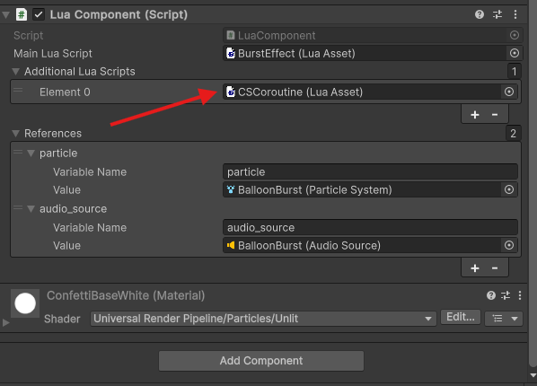

# immerza-sdk

## Installation
* **Recommended: Add this repo as a submodule to your existing one**
* While in Assets folder:
* -> git submodule add https://github.com/getimmerza/immerza-sdk.git
* -> git mv immerza-sdk Immerza
* Download only the contents of the repo with the Download ZIP Button
* Add the Splines (v2.7.2) and XR Interaction Toolkit (v3.0.7) packages
* **IMPORTANT: The folder should be inside the assets folder and have the name "Immerza"**

## Setup
* Add a GameObject with an ImmerzaLuaManager component into your scene
* After that you can add a LuaComponent to any GameObject you like and reference your Lua script, the fields you want to reference from within the scene and/or any assets you want to have available in your Lua script

## MonoBehaviour methods
### Most MonoBehaviour methods are supported (C# -> Lua):
* Awake -> awake
* Start -> start
* OnEnable -> on_enable
* OnDisable -> on_disable
* Update -> update
* OnDestroy -> on_destroy
#### Collision
* OnCollisionEnter -> on_collision_enter
* OnCollisionStay -> on_collision_stay
* OnCollisionExit -> on_collision_exit
* OnTriggerEnter -> on_trigger_enter
* OnTriggerStay -> on_trigger_stay
* OnTriggerExit -> on_trigger_exit
#### Example
```lua
function start()
	CS.UnityEngine.Debug.Log("Hello")
end

function update()
	CS.UnityEngine.Debug.Log("This message is coming from void Update().")
end
```
## C# and Unity Classes and Methods
* You can access them via 'CS' and then the namespace + class and then your desired method
* Objects that are instances of them can also be used, but some are restricted due to security reasons (namely UnityWebRequests, System.IO, etc...)
#### Example
```lua
function start()
	CS.UnityEngine.Debug.LogWarning("This is a warning.")
    	self:GetComponent("MeshRenderer").enabled = false
	-- gameObject variable could also be used instead of this - this refers to the LuaComponent
end

local unity = CS.UnityEngine

function update()
	local x = unity.Mathf.Cos(unity.Time.time)
	local y = unity.Mathf.Sin(unity.Time.time)

	local new_pos = unity.Vector3(cube_location.transform.position.x, cube_location.transform.position.y, cube_location.transform.position.z)

    local new_rot = unity.Quaternion.Euler(x * 360.0, 0.0, y * 360.0)

    cube_to_spin.transform:SetPositionAndRotation(new_pos, new_rot)
end
```
## Communication between scripts
* You can use the Lua global environment to message between scripts
* It is also possible to just directly get the LuaComponent and its scriptEnv to execute functions or access variables on the object
#### Example:
```Lua
obj:GetComponent("LuaComponent").scriptEnv.do_something()
obj:GetComponent("LuaComponent").scriptEnv.some_variable
```

* The SDK has an event system where you can register and trigger events from any script and provide a custom payload
#### Example:
**OneLuaScript.lua:**
```Lua
local lua_util = CS.ImmerzaSDK.Lua.LuaComponent

function awake()
	lua_util.RegisterEvent("CubeNotify", function (event_data)
			unity.Debug.Log(event_data.message)
		end
	)
end
```

**AnotherLuaScript.lua:**
```Lua
local lua_util = CS.ImmerzaSDK.Lua.LuaComponent

function start()
    lua_util.TriggerEvent("CubeNotify", { message = "Hello from GetLuaComponentReference!" })
end

-- Result: OneLuaScript instance prints "Hello from GetLuaComponentReference!"
```

## UI
* The SDK has default Unity UI support
#### Example
```lua
local unity = CS.UnityEngine
local crt_num = 0

function start()
	local num_comp = num_field:GetComponent("TMP_Text")
	num_comp.text = crt_num
	increment_button:GetComponent("Button").onClick:AddListener(function()
		crt_num = crt_num + 1
		num_comp.text = crt_num
	end)
end
```

## Utility scripts
* You can add additional scripts to your LuaComponents that will not share the same scripting environment as your component
* They can then be imported via the 'require' statement in the Lua script
#### Example:


## Coroutines
* To use coroutines, add the CSCoroutine.lua file from the Examples folder into your additional scripts in the LuaComponent
#### Example:
```Lua
local unity = CS.UnityEngine

local cs_coroutine = (require 'CSCoroutine')

function play_effect()
	particle:Play()
	audio_source:Play()

	cs_coroutine.start(self, function() -- can pass any function
		coroutine.yield(CS.UnityEngine.WaitForSeconds(1))
		unity.GameObject.Destroy(gameObject)
	end)
end
```

## 

## Things to check when exporting the scene:
* Check that only one LuaManager instance is present in the scene
* Subscribe to the OnPauseRequested event in the class ImmerzaEvents and provide a pause implementation
* Have atleast one NearFarInteractor in one of the Hands/Controllers and set it to an unused XR Interaction Layer.
#### Example:
```Lua
function awake()
	CS.ImmerzaSDK.ImmerzaEvents.OnPauseRequested('+', on_pause_requested)
end

function on_pause_requested(shouldPause)
	if shouldPause then
		-- implement pause
	else 
		-- implement continue
	end
end
```
<br>

* If you want to end the scene, you can call EndScene()
#### Example:
```Lua
function start()
	CS.ImmerzaSDK.ImmerzaEvents.EndScene()
end
```

## Full example project
* [https://github.com/getimmerza/balloon-example-scene](https://github.com/getimmerza/balloon-example-scene)
